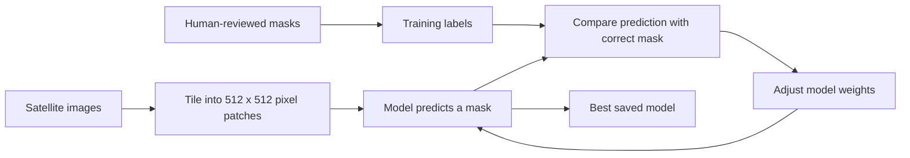
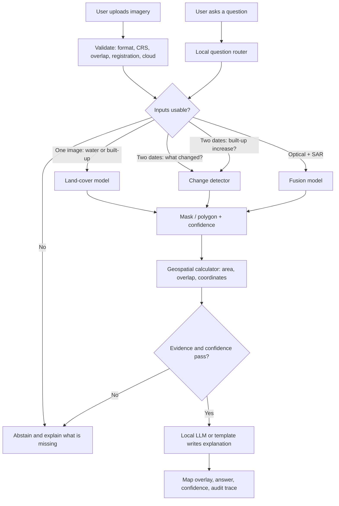

# SatQuery AI: How We Will Build It

## The goal in one sentence

Given one image, a before/after pair, or an optical+SAR pair and a plain-English question, SatQuery AI chooses the right vision model, obtains visible map evidence, measures it, and returns an answer only when the evidence is reliable.

## What “training a model” means

Training means showing a computer many examples where the correct answer is already marked.

For a river-expansion task, each example contains:

```text
Input:   Satellite image at Time 1 + same location at Time 2
Label:   A map mask showing the river/water pixels in both images
Target:  A mask showing which water pixels were added or removed
```

The model repeatedly predicts the mask, compares it to the human-reviewed label, and adjusts itself to reduce mistakes. It never learns from a text answer alone; it learns from image pixels paired with spatial labels.

## The first version: four specialists, not thousands of models

| Specialist | Challenge requirement it serves | Input | Trained output |
| --- | --- | --- | --- |
| Land-cover segmentation | Single image questions and grounding | One optical/multispectral image | Pixel masks for water, built-up, vegetation, agriculture, other |
| Change detector | Bi-temporal change intelligence | Before + after images of the same location | Changed/unchanged mask and change class |
| Optical–SAR fusion model | Cross-modal analysis | Co-registered optical + SAR pair | Better water/built-up masks plus quality flags |
| Remote-sensing VLM | Scene description and question understanding | Image plus question | Task label and grounded description; never a measurement source |

The geospatial calculator is not trained. It converts the final mask into real area and coordinates using the GeoTIFF’s CRS, pixel size, and transform.

## The data we need

No actual training dataset has been supplied to this project yet. The following is the required dataset specification.

| Use case | Minimum record | Required label |
| --- | --- | --- |
| Water/built-up/vegetation in one image | Georeferenced optical image with bands and metadata | Pixel polygons/masks for each class |
| River, vegetation, or built-up change | Two co-registered images of the same footprint at different dates | Changed-area mask and change type |
| Optical + SAR analysis | One optical and one SAR image of the same footprint, closely dated and aligned | Water/built-up/land-cover masks and quality labels |
| Question answering | Any supported image input | Question, intended task, evidence-mask ID, answerable/unanswerable label |

Every record also stores sensor, acquisition date, CRS, resolution, footprint, cloud/shadow status, source licence, annotator, and annotation version.

## How we create the labels

1. Load a georeferenced image or compatible image pair in QGIS, CVAT, or Label Studio.
2. An annotator traces polygons for water, built-up areas, vegetation, and other agreed classes.
3. For a temporal pair, the annotator marks only genuine changes, such as water expansion or new construction.
4. A reviewer checks a sample independently. Disagreements are corrected by a domain reviewer.
5. Cloud, shadow, and uncertain boundaries are marked as “ignore,” never silently called a class.

Start with a reviewed pilot of 100 image pairs. Once the rules are stable, expand to 500–1,000 temporal pairs and 1,000–3,000 diverse single-image tiles for the first MVP.

## How a model is trained



We begin from an existing remote-sensing model that has already learned general visual patterns. We fine-tune it on our reviewed labels rather than attempting to train a giant model from zero.

For each specialist, train two or three practical candidates:

| Task | Candidate models to compare | Select by |
| --- | --- | --- |
| Land cover | U-Net, SegFormer, Mask2Former | Per-class IoU, especially water/built-up/vegetation |
| Change detection | Siamese U-Net, ChangeFormer | Change F1, change IoU, false-alarm rate |
| Optical–SAR fusion | Late-fusion U-Net, dual-encoder transformer | Improvement over optical-only results |
| Scene description/VQA | Remote-sensing adapted VLM or constrained structured renderer | Expert answer correctness and evidence grounding |

We do not select a model because it gives a convincing sentence. We select it because it is most accurate on unseen, reviewed images and produces usable spatial evidence.

## How we validate without fooling ourselves

Split imagery by **location and date** before training:

```text
Training:   locations/dates the model learns from
Validation: different locations/dates used to choose the model and threshold
Test:       final unseen locations/dates used only for the final score
```

Do not randomly split neighbouring image tiles. That would allow the model to see almost the same location during training and testing.

For each candidate, report:

| Question | Validation measure |
| --- | --- |
| Did it find water/built-up/vegetation? | Class IoU and precision/recall |
| Did it identify a real change? | Change F1 and change IoU |
| Did it create false change alarms? | False-positive rate |
| Is its area value correct? | Difference from reviewed polygon area |
| Does it refuse when it should? | Correct-abstention rate on cloud, misalignment, unsupported tasks |

The winner is the model with the best balanced score on the validation set, acceptable speed, and reliable evidence. The untouched test set is used once to report final performance.

## How orchestration works



The “orchestrator” is simply the controller above. It does four jobs:

1. Reads the question and available input type.
2. Sends work to the correct specialist model(s).
3. Checks that the returned mask and confidence are usable.
4. Gives only verified results to the local language model for explanation.

Example:

```text
Question: “Has the river expanded?”
Inputs:   Before and after optical GeoTIFFs
Route:    Image validation → change detector → water mask check → area calculator
Evidence: Added-water polygon highlighted on the map
Answer:   Generated from the calculated result, with confidence and model version
```

## Why the components are separate

| Component | Why it exists |
| --- | --- |
| Validator | Prevents invalid before/after comparisons and misleading results |
| Specialist models | Different tasks need different visual skills |
| Geospatial calculator | Makes area/coordinates mathematically correct instead of language-model guesses |
| Confidence/abstention policy | Avoids fabricated certainty on cloudy, misaligned, or unsupported inputs |
| Local language model | Lets non-GIS users ask naturally and receive a readable explanation |

## Hardware and delivery requirements

| Work | Practical requirement |
| --- | --- |
| Data preparation and annotation | 16-core CPU, 64 GB RAM, 1–2 TB NVMe SSD |
| Initial segmentation/change training | NVIDIA GPU with 24 GB VRAM, 64 GB RAM |
| Larger fusion or VLM adapter experiments | 48 GB VRAM or two 24 GB GPUs |
| Local demo inference | One GPU with 16–24 GB VRAM and a CPU geospatial worker |
| Software | Python, PyTorch, Rasterio/GDAL, GeoPandas, QGIS/CVAT/Label Studio, Docker, model/version tracker |

## Eight-week MVP plan

| Week | Deliverable |
| --- | --- |
| 1 | Receive data, audit metadata, agree classes, write annotation guide |
| 2 | Complete and review 100-pair annotation pilot; build preprocessing pipeline |
| 3 | Train and evaluate land-cover candidates |
| 4 | Train and evaluate change-detection candidates |
| 5 | Select winners, tune thresholds, test failure cases and abstention |
| 6 | Connect selected models to the SatQuery AI inference API and evidence viewer |
| 7 | Add optical–SAR fusion experiment and local explanation layer |
| 8 | Run final unseen-location evaluation, create model cards, package demo |

## Pitch for the judge

“We will build SatQuery AI as an evidence-first orchestration system. First, we obtain georeferenced satellite imagery and human-reviewed spatial labels. We train a small set of specialised models: one for land cover, one for change between two dates, and one for optical–SAR fusion. Every model returns masks or polygons rather than only text. We compare candidate models on locations and dates they have never seen, choose the best one for each task using accuracy, false-alarm, and area-error metrics, and freeze a final test set for honest reporting. The controller validates the upload, selects the right model from the question and input type, calculates measurements from the returned geometry, and only then lets a local language model explain the verified result. If inputs are invalid or confidence is low, it abstains rather than fabricating an answer.”
