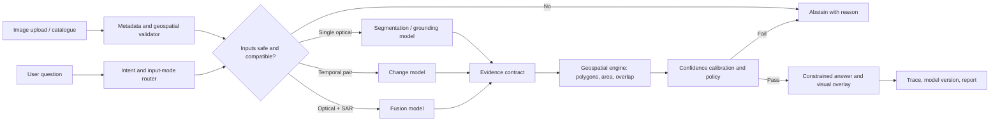

# SatQuery AI: Model Training and Delivery Roadmap

## The honest starting point

The current localhost product is a working **prototype**, not a trained remote-sensing AI system. It uses curated demo imagery, deterministic task routing, fixture polygons, and a geospatial area calculation to demonstrate the intended user experience. It does not call GPT, an API model, or locally trained model weights while answering the supplied demo questions.

This is deliberate for the demo: every shown answer can be traced to its illustrative evidence. The production system will replace each fixture-based specialist with a trained model, while retaining the same validation, evidence, confidence, and reporting flow.

There is no supplied satellite dataset in this repository yet. The repository contains one reference JPEG and demo fixtures only. Therefore, the team must not claim that a provided dataset has been audited or that it is annotated until the actual image collection and label files are received and inspected.

## What we will build

SatQuery AI is not one model and should not be presented as “an LLM that looks at satellite images.” It is a spatial-evidence system with five components:

| Component | Purpose | Candidate implementation | Output |
| --- | --- | --- | --- |
| Input and geospatial validation | Read imagery and reject unusable comparisons | Rasterio/GDAL, GeoPandas, OpenCV | CRS, resolution, date, footprint, cloud/registration warnings |
| Scene understanding model | Identify land-cover and scene content in one image | SegFormer or U-Net with a remote-sensing encoder | Pixel mask and per-class confidence |
| Change intelligence model | Find meaningful differences in co-registered images from two dates | Siamese U-Net or ChangeFormer | Change mask, change class, confidence |
| Optical–SAR fusion model | Combine Sentinel-2 optical imagery with Sentinel-1 SAR when both are available | Dual-encoder late fusion network | Fused mask/classification and modality quality flags |
| Language and orchestration layer | Interpret the question, select the specialist, and write an explanation from verified evidence | Small intent classifier plus constrained LLM/template renderer | Task plan, cited spatial evidence, answer or abstention |

The language layer never invents an area, change, or object. It can state a result only after a vision model returns a mask, polygon, or detection and the geospatial engine computes the requested metric from the source image metadata.

## MVP scope: keep the first trained release narrow

The first trained version should support the following claims well before expanding:

1. **Single optical image:** water, built-up area, vegetation, agriculture, bare land/other, and cloud/shadow masking.
2. **Two co-registered optical images:** new construction, vegetation loss/gain, water expansion/contraction, and “no material change.”
3. **Optical plus SAR:** classify broad land-cover and water-related questions when optical imagery has cloud limitations.
4. **Evidence-first questions:** “Where is water?”, “How much built-up area?”, “What changed between these dates?”, and “Show the changed regions.”
5. **Safe abstention:** reject questions when imagery is missing, dates cannot be compared, cloud is excessive, registration is poor, the task is outside the trained label set, or confidence is below threshold.

Fine-grained claims such as crop disease, building damage severity, road condition, or exact object counting need separate data and should be added only as separately evaluated modules.

## Data intake and audit: Week 1

Before training, create a data catalogue. Every scene or temporal pair needs an immutable record containing:

- image identifier, source and licence;
- sensor/platform, acquisition time, bands, bit depth, radiometric processing level;
- CRS, affine transform, spatial resolution, footprint, nodata value, cloud/shadow estimate;
- temporal-pair identifier, overlap percentage, alignment status, season gap, and sensor compatibility;
- annotation version, annotator, reviewer, label source, and quality status.

The audit answers four questions: Can files be opened? Are they georeferenced? Are there labels? Are labels tied to the same pixel grid and task definition as the images?

Split the data by **geography and time**, never random adjacent tiles. Otherwise nearly identical locations can appear in both training and test sets and produce misleadingly high scores. Keep a final unseen test set from different districts and dates.

Preprocess as reproducible tiles, for example 512 × 512 pixels with overlap. Preserve CRS and transform for every tile so a predicted pixel mask can be converted back to area and map coordinates. Normalize each sensor separately; Sentinel-2 multispectral bands and Sentinel-1 backscatter must not be treated as ordinary RGB images.

## Annotation plan

### 1. Semantic land-cover masks

Annotate pixel-level polygons or masks for a limited, mutually agreed taxonomy:

- water;
- built-up / impervious surface;
- vegetation / forest;
- agriculture;
- bare soil / other;
- cloud and cloud shadow as an ignore or quality class.

Use polygons for large continuous regions and rasterize them to masks at the imagery’s native training grid. Record ambiguous boundaries and do not force a class where resolution cannot support the decision.

### 2. Change annotations

For each aligned pair `(T1, T2)`, label:

- a binary changed/unchanged mask;
- change type: new construction, demolition, vegetation loss, vegetation gain, water expansion, water contraction, or other;
- whether the pair is sufficiently registered and seasonally comparable;
- uncertain and cloud-covered areas as ignore regions.

The same coordinates must refer to the same ground location in both dates. Misaligned pairs create false change labels, so registration QA is a required gate before annotation.

### 3. Grounding and question-answer labels

For each supported question, store a structured record rather than only natural language:

```json
{
  "question": "Where are the new built-up areas?",
  "task": "semantic_change_grounding",
  "answer_class": "new_construction",
  "evidence_geometry": "polygon-or-mask-id",
  "answerable": true,
  "units": "square_metres"
}
```

Add deliberately unanswerable examples: wrong modality, missing date, cloud cover, unsupported class, and low-resolution imagery. These examples teach the controller when to abstain.

### 4. Annotation operations and quality

Use CVAT, QGIS, or Label Studio with locked class definitions and examples. A realistic first target is a 100-pair pilot set to validate instructions, then 500–1,000 quality-reviewed temporal pairs for the first change model. For segmentation, aim for 1,000–3,000 diverse labelled tiles, expanding classes only when enough examples exist.

Each item receives one annotation, independent review on a sampled subset, and adjudication for disagreements. Track inter-annotator agreement, boundary IoU, class balance, and rejection reasons. The gold validation and test sets must be reviewed by a domain expert and frozen before final model selection.

## Training strategy

Do not train a foundation model from scratch. Start from pretrained remote-sensing encoders and fine-tune task heads on the project’s labelled data. Public benchmarks are useful for initialization and practice, but local data is required for claims about the target geography and use cases.

1. **Data baselines.** Train a simple U-Net/SegFormer segmentation baseline and a Siamese change baseline. This establishes whether the labels and preprocessing are sound.
2. **Scene model.** Fine-tune a multispectral segmentation model on the land-cover masks. Use weighted sampling and class-balanced loss to protect rare water or change classes.
3. **Change model.** Fine-tune a Siamese model using aligned `T1/T2` pairs. Train with binary change plus semantic change-type heads, and exclude cloud/misaligned pixels from loss and evaluation.
4. **Fusion model.** Train separate optical and SAR encoders, then combine their features after each encoder has a useful baseline. Do not fuse modalities until timestamps, footprints, and resolutions are compatible.
5. **Grounding/VQA layer.** Generate answers from structured model outputs first. If a vision-language model is added later, adapt it with parameter-efficient fine-tuning (LoRA) on question–evidence pairs. It must return an evidence reference and confidence; it is never the source of area calculations.
6. **Calibration and abstention.** Reserve a calibration set to choose thresholds. Low confidence, missing evidence, large registration error, or poor image quality must produce “cannot verify from these inputs,” with a reason.

Useful public starting references include [BigEarthNet v2.0](https://bigearth.net/), which provides paired Sentinel-1/Sentinel-2 patches and land-cover labels, [SEN12MS](https://github.com/schmitt-muc/SEN12MS), which provides georeferenced Sentinel-1/2 data for fusion research, and [LEVIR-CD](https://github.com/justchenhao/LEVIR), a building-change benchmark. These benchmark labels are not substitutes for annotations of the target application or target geography.

## Orchestration architecture



Every specialist must return a typed evidence contract:

```text
model_id, model_version, task, input_ids, CRS, affine_transform,
mask_or_geometry, class_scores, image_quality_flags, registration_error,
runtime_ms, calibration_version
```

The current code already has the product seams for this plan: input validation, specialist routing, an inference adapter, a model registry, evidence overlays, confidence thresholds, history, and reports. The work is to implement the model adapters and replace demo fixtures with saved inference results.

## Evaluation and acceptance criteria

Use separate metrics for each claim:

| Capability | Primary measures | Acceptance evidence |
| --- | --- | --- |
| Land-cover segmentation | class IoU, mean IoU, precision/recall | held-out geography and seasons |
| Change detection | change IoU, F1, false-alarm rate, missed-change rate | aligned unseen temporal pairs |
| Grounding | mask IoU / detection AP, evidence coverage | reviewer checks that answer matches shown region |
| Area estimate | absolute/relative area error | comparison against reviewed polygons |
| VQA / explanation | answer correctness, groundedness, abstention precision | blind domain-expert review |
| Reliability | calibration error, risk–coverage curve | threshold selected on calibration set, not test set |

Publish model cards containing data sources, class definitions, geography, known failures, hardware, metrics, intended use, and the exact model/annotation versions. Test separately for clouds, shadows, monsoon/season changes, speckle, resolution differences, and temporal misregistration.

## Hardware and software plan

| Stage | Practical configuration | Why |
| --- | --- | --- |
| Data preparation and annotation server | 12–16 CPU cores, 64 GB RAM, 1–2 TB NVMe storage | Raster reads, tiling, label management, cached data |
| First segmentation/change fine-tuning | One NVIDIA GPU with 24 GB VRAM, 64 GB RAM | 512-pixel tiles, mixed precision, gradient accumulation |
| VLM adapter fine-tuning or larger fusion experiments | 48 GB VRAM, or 2 × 24 GB GPUs | More room for vision-language adapters and experiments |
| Production demonstration inference | 16–24 GB NVIDIA GPU plus CPU geospatial worker | Fast interactive prediction with map calculations outside the GPU |
| Scale-out training | rented 40/80 GB A100-class GPU only when justified by measured need | Avoid buying hardware before baselines and data quality are proven |

Use Python, PyTorch, Rasterio/GDAL, GeoPandas, OpenCV, an experiment tracker such as MLflow or Weights & Biases, object storage for immutable imagery, a versioned dataset manifest, and a containerized inference API. Mixed precision, tiling, and gradient accumulation let the first models run on one 24 GB GPU; exact needs depend on image bands, tile size, model size, and batch size.

## Eight-week delivery plan

| Week | Deliverable | Evidence for review |
| --- | --- | --- |
| 1 | Dataset audit, task taxonomy, annotation guide, geographic/time split | Data inventory and 100-item annotation pilot |
| 2 | Reproducible preprocessing, tiling, registration checks, label QA workflow | Versioned training/validation/test manifests |
| 3 | First land-cover segmentation baseline | Per-class held-out metrics and visual error review |
| 4 | First binary/semantic change baseline | Change masks, false-positive analysis, calibration draft |
| 5 | Improve labels/model, add uncertainty and abstention gates | Frozen gold test set and threshold policy |
| 6 | Integrate trained adapters with SatQuery AI, evidence overlays, reports | Local end-to-end demo with model version trace |
| 7 | Optical–SAR fusion experiment and controlled VQA/explanation layer | Comparison against optical-only baseline |
| 8 | Field/domain review, model card, deployment package, supervisor demo | Final held-out evaluation and known-limitations report |

This schedule assumes access to imagery, a domain reviewer, and one 24 GB GPU. If annotations must be created from scratch at scale, annotation work becomes the critical path and should run in parallel from Week 1.

## What to say to the judge

“Today’s application is a transparent user-interface prototype. Its demo answers are curated, so we do not present them as trained-model predictions. Our next step is to train separate spatial models for segmentation, temporal change, and optical–SAR fusion on georeferenced, quality-reviewed annotations. The controller only selects the specialist and explains verified evidence. The vision model produces masks or polygons; the geospatial engine computes areas from those masks and the image CRS; then a confidence policy decides whether to answer or abstain. We will validate on locations and dates never seen in training, publish per-task metrics and model cards, and deploy the trained adapters behind the existing local product within an eight-week MVP plan.”

## Immediate next actions

1. Obtain the actual imagery and labels, then run the data audit before selecting a final model.
2. Agree on the initial five-to-six class taxonomy and change definitions with the domain reviewer.
3. Create and review the 100-pair annotation pilot; revise the guide before mass annotation.
4. Train the simple segmentation and change baselines first; use results to expose data issues.
5. Freeze a geographically and temporally separate gold test set before model tuning.
6. Integrate only evidence-producing models into the existing SatQuery AI inference adapter.
